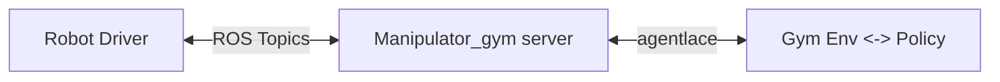

# AutoEval

[](https://arxiv.org/abs/2503.24278)
[](https://opensource.org/licenses/MIT)
[](https://auto-eval.github.io/)

Code Release for [AutoEval: Autonomous Evaluation of Generalist Robot Manipulation Policies in the Real World](https://auto-eval.github.io/assets/paper.pdf). Check out [auto-eval.github.io](https://auto-eval.github.io/) to access the open-access evaluation dashboard on WidowX robots and for instructions of how to get your own policies evaluated by AutoEval. You can host your policy as a server and pass along the IP and port to the dashboard and submit an evaluation job in minutes.

The [website](https://auto-eval.github.io/) contains all the details on submitting jobs to our Bridge-AutoEval stations with four different tasks. The instructions below are for setting up a new AutoEval station locally for a new task, and hosting a dashboard for policy submission.


## Installations

Create your conda environment:
```bash
conda create -n autoeval python=3.10 -y
conda activate autoeval
pip install -r requirements.txt
pip install -e .
```

You will also need the following dependencies:
 - `manipulator_gym` for the robot environment: https://github.com/rail-berkeley/manipulator_gym
 - `agentlace` for distributed policy and robot environments: https://github.com/youliangtan/agentlace
 - `robot_eval_logger` for logging: https://github.com/zhouzypaul/robot_eval_logger

Other optional packages:
 - `jaxrl_m` (Optional, for jaxrl goal-conditioned policy): https://github.com/rail-berkeley/soar/tree/main/model_training
 - `susie` (Optional, for SuSIE/SOAR policy): https://github.com/kvablack/susie
 - `simpler_env` (Optional, for sim evaluation in SIMPLER): https://github.com/youliangtan/SimplerEnv

We use a slack bot to send automated messages to a slack channel when human intervention is required in AutoEval. To use the slack bot, you need to create a slack app (see [here](https://help.thebotplatform.com/en/articles/7233667-how-to-create-a-slack-bot) for instructions), give in write permission to the channel, and set environment variables:
```bash
export SLACK_BOT_TOKEN=<TOKEN>  # e.g. xoxb-...
export SLACK_CHANNEL_ID=<CHANNEL_ID>  # e.g. C06...
```
If you don't want to use the slack bot, you can use the `--no_slack_bot` flag in `run_eval.py`, which creates a dummy bot that prints out messages in the terminal instead of sending them to slack.

## Quick Start
### Setting Up the Robot Environment
We use [manipulator_gym](https://github.com/rail-berkeley/manipulator_gym) and [agentlace](https://github.com/youliangtan/agentlace) to distribute the robot gym-like environment and policy execution (as illustrated below). The robot environment is run on a robot server machine, which can be a lightweight machine (e.g. Intel NUC) that only needs to run ROS and simple python scripts.



```bash
# 1. start ros services
roslaunch interbotix_xsarm_control xsarm_control.launch robot_model:=wx250s use_rvix:=false

# 2. start robot server
cd manipulator_gym
python3 manipulator_server.py --widowx --cam_ids 0
```

You would also need to install the `interbotix_ros_arms` package for the WidowX robot.See [manipulator_gym's descriptions](https://github.com/rail-berkeley/manipulator_gym?tab=readme-ov-file#viperx-or-widowx) for more details.

### Important Code Snippets
Below we describe the main evaluation script and the two ways to run policies: (1) locally (where this auto_eval package is run) or (2) remotely with a policy server-client setup.
- [run_eval.py](run_eval.py): Main script for running evaluations.
- [scripts/configs/eval_config.py](scripts/configs/eval_config.py): Configuration file for evaluations, contains the task and policy configurations. Add new entries here for setting up new tasks.
- [auto_eval/robot/policy.py](auto_eval/robot/policy.py): Different robot policies that you can run locally, no need for policy server-client setup. Add new classes here for new policies.
- [auto_eval/robot/policy_clients.py](auto_eval/robot/policy_clients.py): Different policy clients for when a policy is set up as a server remotely instead of run locally with `policy.py`. `OpenWebClient` is a generic policy client that can be used for any policy server that conforms to the AutoEval API.
- [auto_eval/policy_server/*](auto_eval/policy_server): Pre-made policy servers for some SOTA generalist robot policies. Add new servers here for new policies.

### Running a Human Eval
```bash
# <ROBOT_IP> is the IP address of the robot machine that runs the robot environment
# make sure to edit `scripts/configs/eval_config.py` to ensure the task is set up correctly and the policy client type is correct.
python run_eval.py --robot_ip <ROBOT_IP> --config scripts/configs/eval_config.py:open_drawer --policy_server_ip <POLICY_SERVER_IP> --policy_server_port <POLICY_SERVER_PORT> --human_eval
```

### Running an Automated Eval
```bash
# <ROBOT_IP> is the IP address of the robot machine that runs the robot environment
# make sure to edit `scripts/configs/eval_config.py` to ensure the task is set up correctly and the policy client type is correct.
python run_eval.py --robot_ip <ROBOT_IP> --config scripts/configs/eval_config.py:open_drawer --policy_server_ip <POLICY_SERVER_IP> --policy_server_port <POLICY_SERVER_PORT>
```
You can also use the bash scripts under `scripts/launch_*.sh` to run evaluations for the five tasks defined in the paper.


## Success Detector
We learn a success detector by fine-tuning the Paligemma VLM. We collect images and fine-tune the VLM in the forms of VQA questions (e.g. "Is the drawer open?") and train the model to output `yes/no`.

You must be authenticated to huggingface to use paligemma. To authenticate, check out the top of the page [here](https://huggingface.co/google/paligemma-3b-pt-224).
Then, run
```bash
huggingface-cli login
```

1. Collect images by tele-operating the robot. Save all images corresponding to a certain label in a pickle file.
```bash
# the default option uses keyboard to control the robot (key bindings will be printed out in the terminal)
# input keyboard options in the visualizer window, not the terminal
# you can also use `--use_spacemouse` to tele-operate the robot. Tested only with WidowX.
python scripts/teleop.py --ip <ROBOT_IP> --log_type pkl --log_dir ~/datasets/record-open_drawer.pkl
python scripts/teleop.py --ip <ROBOT_IP> --log_type pkl --log_dir ~/datasets/record-close_drawer.pkl
```

2. Finetune Paligemma with the collected images. [script/ft_paligemma.py](script/ft_paligemma.py) will look for specific file names in the `working_dir`. For example, for `--dataset_type drawer`, it will look for `record-open_drawer.pkl` and `record-close_drawer.pkl`. See [script/ft_paligemma.py](script/ft_paligemma.py) for details.
```bash
python scripts/ft_paligemma.py --working_dir ~/datasets/ --dataset_type drawer
```

3. Evaluate the fine-tuned Paligemma model.
```bash
# evaluate the fine-tuned checkpoint on held-out test set
python scripts/ft_paligemma.py --working_dir ~/datasets --model_id ~/datasets/checkpoints/... --eval

# teleop the robot and query the model to see where it succeeds/fails
# you can collect more images on where the classifier fails
python scripts/teleop.py --ip <ROBOT_IP> --pg ~/datasets/checkpoints/...  # use p option in the visualizer window
```

4. Optional: "Dagger" and improve the classifier. In addition to tele-operating the robot and seeing the failure points, you can also run an automated evaluation, and collect all the images that are input to the classifier, and manually label them as additional training data.
```bash
# run the eval with --save_classifier_data
python run_eval.py --save_classifier_data

# manually filter and label the images
# see filter_images.py for details
# the output files will be saved in `--output_folder/positive.pkl` and `--output_folder/negative.pkl`. Move them to the `working_dir` to train the classifier.
python scripts/filter_images.py --input_folder ~/auto_eval_log/... --output_folder ~/datasets/

# In case you want to check the data you have collected and go through them and relabel manually, run
python scripts/relabel_images.py --input_dir /path/to/dir/with/pickle/files --output_dir /path/to/output
```


## Reset Policy
### Learned Reset Policy
To get a robust reset policy, we collect a small number of demos (about 50) and fine-tune [OpenVLA](https://github.com/openvla/openvla).

1. Collect demonstrations with teleoperation. You can do so easily with keyboard/spacemouse. This will save the demos directly in RLDS format.
```bash
# default option is keyboard teleop (key bindings will be printed out in the terminal, use them in the visualizer window)
# use --use_spacemouse to teleoperate with spacemouse. Tested only with WidowX.
python scripts/teleop.py --ip <ROBOT_IP> --log_dir ~/datasets/drawer-scene-demos --log_lang_text "open the drawer"
```

You can also collect demonstrations with a VR headset as described by the [BridgeData V2 paper](https://github.com/rail-berkeley/bridge_data_robot?tab=readme-ov-file#data-collection). The default data collection code will save the demos in a raw format, and you would need to convert them to RLDS format with [dlimp](https://github.com/zhouzypaul/dlimp) to make them readable with the OpenVLA dataloader. In dlimp, set `TRAIN_PROPORTION=0.99` and `DEPTH=2`, and make sure the manually override the language instructions of these demos.
```bash
cd dlimp/rlds_converters/bridge_dataset
CUDA_VISIBLE_DEVICES="" tfds build --manual_dir ~/datasets/drawer-scene-demos
```

2. Fine-tune OpenVLA vis LoRA
Make the following file structure:
```bash
~/checkpoints/auto-eval-openvla-drawer
 |_ checkpoints             # full merged model checkpoints
 |_ adapter_checkpoints     # adapter checkpoints
 |_ bridge_orig
    |_ 1.0.0
       |_ dataset_info.json
       |_ features.json
       |_ expert_demos-train.tfrecord....
```

Move the dataset to this new directory:
```bash
mv ~/tensorflow_datasets/bridge_dataset/ ~/checkpoints/auto-eval-openvla-drawer/bridge_orig
```
We will treat these expert demos as the `bridge_orig` dataset, so we don't need to register the new dataset in the OpenVLA repo.

To start training on a single node:
```bash
torchrun \
  --standalone \
  --nnodes 1 \
  --nproc-per-node 1 \
  scripts/ft_openvla.py \
  --batch_size 32 \
  --shuffle_buffer_size 1000 \
  --lora_rank 64 \
  --data_root_dir ~/checkpoints/auto-eval-openvla-drawer \
  --dataset_name bridge_orig \
  --run_root_dir ~/checkpoints/auto-eval-openvla-drawer/checkpoints \
  --adapter_tmp_dir ~/checkpoints/auto-eval-openvla-drawer/adapter_checkpoints \
  --use_quantization true \
  --save_steps 1000 \
  --max_steps 3000 \
  --wandb_project auto-eval-openvla-ft \
  --wandb_entity <WANDB_ENTITY>
```

3. Evaluate the fine-tuned policy
```python
# Option 1: Use the base OpenVLA model and pass in the LoRA adapters and the new dataset statistics json.
# this will load the base OpenVLA model and merge in the local LoRA adapter with peft
from auto_eval.robot.policy import OpenVLAPolicy
policy = OpenVLAPolicy(
    lora_adapter_dir="~/checkpoints/auto-eval-openvla-drawer/adapter_checkpoints",
    dataset_stats_path="~/checkpoints/auto-eval-openvla-drawer/bridge_orig/1.0.0/dataset_info.json",
)
```

```bash
# Option 2: Host an OpenVLA server with the merged model weights under `checkpoints`.
# this will load the merged model weights from the `checkpoints` directory
python auto_eval/policy_server/openvla_server.py --openvla_path ~/checkpoints/auto-eval-openvla-drawer/checkpoints
```

You can run the evaluation with `run_eval.py`.


### Scripted Policy
For some more structured environments, we also support using scripted policies as the reset policy. To script a policy, we record a tele-operated demonstration of the policy and replay it for resetting the environment.

To record a tele-operated demonstration, you can use the `teleop.py` script:
```bash
python scripts/teleop.py --ip <ROBOT_IP> --log_type pkl --log_actions_only --log_dir scripted_policy.pkl
```
Then, use `auto_eval/robot/policy.py:RecordedPolicy` to replay the demonstration:
```python
from auto_eval.robot.policy import RecordedPolicy
policy = RecordedPolicy(
    policy_save_path="scripted_policy.pkl"
)
```

## Running Policies Locally & Hosting Policy Servers
In the officially hosted [AutoEval](https://auto-eval.github.io), we use the server-client setup to evaluate policies: users must host their policy as remote servers, and AutoEval will connect to these servers with `OpenWebClient` to retrieve policy outputs.

When setting up a new AutoEval station, you have two options of running policies:
1. Run the policies locally (on the same machine as you run [run_eval.py](run_eval.py))
2. Run policies remotely (on a different machine) as a server, and connect to it with a policy client in [run_eval.py](run_eval.py). This is recommended for resource-intensive policies.

### Running Policies Locally
[auto_eval/robot/policy.py](auto_eval/robot/policy.py) contains different policies that you can run locally. To use a policy, just import the policy class and pass in the required arguments. For example:
```python
from auto_eval.robot.policy import policies
policy = policies["openvla"](
  config={
    "lora_adapter_dir": "~/checkpoints/auto-eval-openvla-drawer/adapter_checkpoints",
    "dataset_stats_path": "~/checkpoints/auto-eval-openvla-drawer/bridge_orig/1.0.0/dataset_info.json",
  }
)
```
[run_eval.py](run_eval.py) and [scripts/configs/eval_config.py](scripts/configs/eval_config.py) also provides examples of using local policies.
To run your own policy, add additional classes to [auto_eval/robot/policy.py](auto_eval/robot/policy.py).

### Running Policies Remotely
The policy server is a REST API server that accepts requests (with observation images, language instructions, proprio states) with the POST request and returns the 7-dim policy actions.
There are some example servers in [auto_eval/policy_server/*](auto_eval/policy_server/*). On the remote machine, start the server with:
```bash
# for example, to start the OpenVLA server
cd auto_eval/policy_server/openvla_server
python3 openvla_server.py
```

To build your own policy server, follow the example in [auto_eval/policy_server/template.py](auto_eval/policy_server/template.py).
You can also build a state-ful server (e.g. one that keeps track of observation history or action chunks), see [auto_eval/policy_server/template_advanced.py](auto_eval/policy_server/template_advanced.py) for an example.

To connect to the policy server, you need to use a policy client in the AutoEval code:
```python
from auto_eval.robot.policy_clients import OpenWebClient
client = OpenWebClient(
    policy_server_ip=...,
    policy_server_port=...,
)
```
Make sure that the machine running the AutoEval code can access the IP and port of the policy server (e.g. by ssh port forwarding or making the policy server public).


## Web UI for Job Submission

We implement a job submission web UI (see official site [here](https://auto-eval.github.io)) with FastAPI in [index.html](static/index.html) and [job_scheduler.py](job_scheduler.py). The UI includes a job submission and status page, and a web viewer for live robot activities.

To start the server locally:
```bash
uvicorn job_scheduler:app --reload --host 0.0.0.0 --port 8080
```
The web UI is available at http://localhost:8080/page.

### Taking Robots "Offline"
We also add functionality to take robots "offline" (e.g. to prevent them from accepting new jobs) for maintenance or other purposes. Use [auto_eval/web_ui/robot_control.py](auto_eval/web_ui/robot_control.py) to take robots offline and bring it back online.
```bash
# View status of all robots
python auto_eval/web_ui/robot_control.py status

# Take a robot offline with a custom message
python auto_eval/web_ui/robot_control.py offline widowx_drawer --message "Under maintenance until tomorrow"
python auto_eval/web_ui/robot_control.py offline widowx_sink --message "Hardware issue"

# Take all robots offline at once
python auto_eval/web_ui/robot_control.py offline all --message "System maintenance"

# Bring a robot back online
python auto_eval/web_ui/robot_control.py online widowx_drawer
python auto_eval/web_ui/robot_control.py online widowx_sink
```


## Eval with Simpler Env

Here we provided `egg-plant-sink` and `drawer` SimplerEnv scenes that match the scenes in our custom auto eval. An example to run the simplerenv example, run the following:

NOTE: this uses custom fork: https://github.com/youliangtan/SimplerEnv

```bash
# Test the simplerenv scenes
python scripts/simpler_eval/eval_simpler.py --test --env widowx_open_drawer
python scripts/simpler_eval/eval_simpler.py --test --env widowx_close_drawer
python scripts/simpler_eval/eval_simpler.py --test --env widowx_put_eggplant_in_basket
python scripts/simpler_eval/eval_simpler.py --test --env widowx_put_eggplant_in_sink

# Openvla policy
python scripts/simpler_eval/eval_simpler.py --env widowx_open_drawer --openvla --server_host localhost

# octo policy
python scripts/simpler_eval/eval_simpler.py --env widowx_open_drawer --octo

# gcbc policy
python scripts/simpler_eval/eval_simpler.py --env widowx_open_drawer --gcbc

# susie policy
python scripts/simpler_eval/eval_simpler.py --env widowx_open_drawer --susie --server_host localhost
```

Change the `--env` argument to run on different tasks.

## Safety

[manipulator_gym](https://github.com/rail-berkeley/manipulator_gym) provides a set of safety gym wrappers that can be used for extended robot operation on the WidowX robot:
```python
from manipulator_gym.utils.gym_wrappers import (
    CheckAndRebootJoints,
    ClipActionBoxBoundary,
    InHouseImpedanceControl,
    LimitMotorMaxEffort,
)
```

To set up the robot safety boundary, you can use the `--track_workspace_bounds` option in `scripts/teleop.py`. Then, teleoperate the robot to the maximum allowed robot workspace, and the maximum xyz coordinates will be recorded and printed out. Then, use the `ClipActionBoxBoundary` wrapper to clip the actions to the safety boundary.

## Contributing
To enable code checks and auto-formatting, please install pre-commit hooks (run this in the root directory):
```bash
pre-commit install

# To run the checks manually
pre-commit run --all-files
```
The hooks should now run before every commit. If files are modified during the checks, you'll need to re-stage them and commit again.
